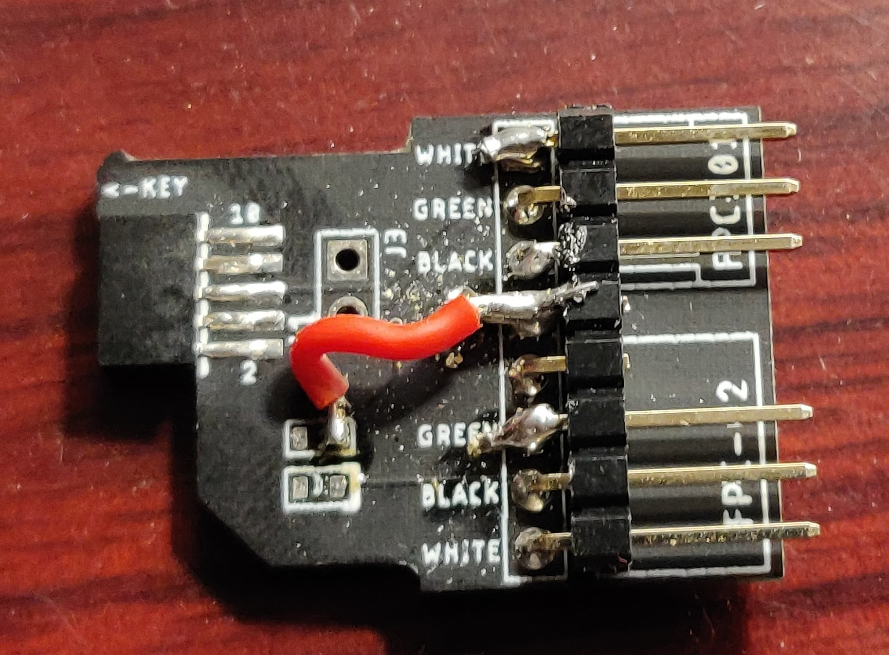
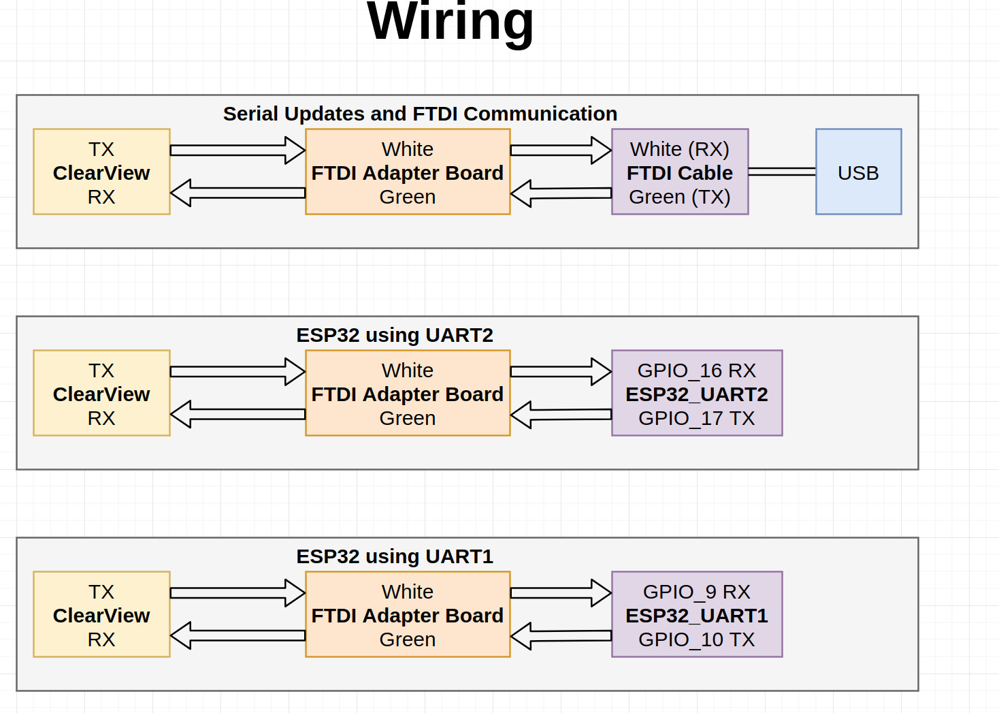

# clearview_interface_public

Repo that contains scripts to control a ClearView receiver as well as the code for the ESP32 wireless module

## Useful Links

[ClearView Website](http://clearview-direct.com/)

[ClearView Updates](http://proteanpaper.com/fwupdate.cgi?comp=iftrontech&manu=2)

## Install

### Install for python library

* `$ git clone https://github.com/ryaniftron/clearview_interface_public.git`
* Install python 3.8.1 or later. Recommended to use pyenv
    `https://realpython.com/intro-to-pyenv/`
* `$ cd clearview_interface_public`
* `$ pyenv install 3.8.1`
* `$ pyenv local 3.8.1`
* `$ python --version`
    Expect `3.8.1`
* `python -m pip install pyserial`

### Install with ESPIDF locally 

1. Remove .espressif if it exists with `$ rm -r ~/.espressif/`
1. Install espidf
1. Checkout and use release/v4.2 branch as shown [here](https://docs.espressif.com/projects/esp-idf/en/latest/esp32/versions.html#updating-to-a-release-branch)

### Install with docker
#### Docker Setup

Warning: Docker only can access USB devices if your host is Linux. See [here](https://github.com/docker/for-win/issues/1018) for Windows and [here](https://github.com/docker/for-mac/issues/900) for Mac.

The 4.3 release will be used for development, as found [here](https://hub.docker.com/r/espressif/idf/tags?page=1&ordering=last_updated)

```
$ sudo docker pull espressif/idf:release-v4.3
```

[ESPIDF Docker Reference](https://docs.espressif.com/projects/esp-idf/en/latest/esp32/api-guides/tools/idf-docker-image.html)

#### Code format

clang-format will be used to format code.
See [here](https://marketplace.visualstudio.com/items?itemName=xaver.clang-format) for vscode setup. Use the format on save option in VSCode.

#### Run Instructions

To build:
```
$ cd src/cvesp32
$ scripts/init.sh
```

To build and connect to /dev/ttyUSB0
```
$ cd src/cvesp32
$ ../scripts/init.sh 0
```
To exit the IDF monitor, type `ctrl+]`

## Usage

Check main.py to turn on simulator if you do not have a ClearView. If you do have one connected, turn off the simulator and supply the correct serial port name. 

* `$ cd clearview_interface_public`
* `$ python src/clearview-py/main.py`

## ESP32 DevKitC Wiring to ClearView 2.0

As of May 2, 2018, the wireless ESP32 modules are still in production at Iftron. To get off the ground running before than, any ESP-wroom-32 development board can be used. 

Required Hardware
* ClearView 2.0 Receiver
* ClearView 2.0 Update Board
* ESP32 Development Board

Connections
* ESP32 P16 (U2RXD)- CV Breakout White (Tx of ClearView)
* ESP32 P17 (U2TXD)- CV Breaktout Green (Rx of ClearView)
* ESP32 GND - CV Breakout GND
* ESP32 3V3 - CV Breakout 3.3V pad 

On the update board, I soldered from the +3.3v pad of the LED to an unconnected pin on the breakout. On the back side, you can then solder a jumper to the ESP32. 





## ESP32 Code Flash Instructions using ESP-WROOM-32 DevKitC
1. Install [ESPIDF](https://docs.espressif.com/projects/esp-idf/en/latest/esp32/get-started/). Ensure you can successfully flash the hello world example 
1. `$ cd clearview_interface_public/src/cvesp32`
1. If you are doing development and want to view the log output, comment out the sdkconfig defaults that are used in production as seen [here](https://github.com/ryaniftron/clearview_interface_public/commit/d65e27b155bef3621c6a612caa728ba843fac178#r39734249)
1. `$ idf.py build flash monitor`
    * You may need to specify port like `$ idf.py -p /dev/ttyUSB0 build flash monitor`
    * On Linux, you can find the port by plugging in the ESP32 and then running `$ dmesg | grep tty`
1. Using any device that supports WiFi and has a web browser, connect to the network starting in "CV"
1. Navigate to the ESP32 Home Page on a web browser `$ http://192.168.4.1`
1. It should show the ClearView ESP32 Config screen

## ClearView ESP32 Dongle Firmware Update Instructions
ClearView manufactures a ready to use module that plugs directly into the ClearView 2.0. This is strongly recommended and does not require installing the ESPIDF development environment
1. Purchase a CV2.0 Wireless Module from ClearView
1. Plug into a ClearView 2.0
1. If the firmware is not up to date, you will be able to update it wirelessly. The exact process is still in development

## Third Party Links

[Matthew Smith CV2.0 Mount](https://www.thingiverse.com/thing:4365784)

[FlyFive33 CV2.0 Mount](https://www.thingiverse.com/thing:3651604)

