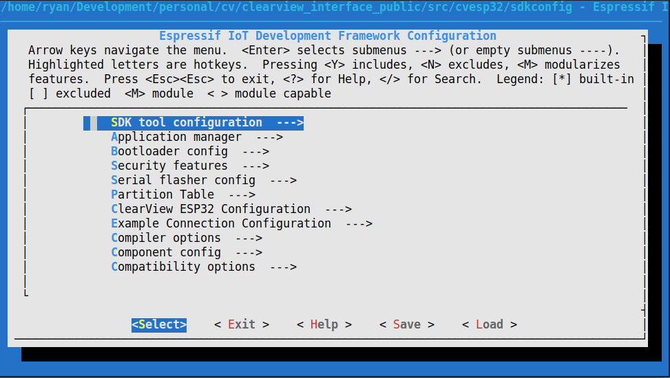
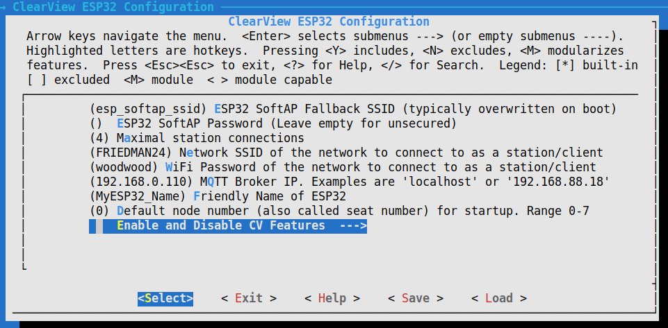
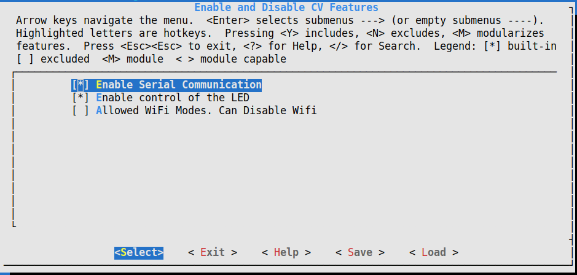
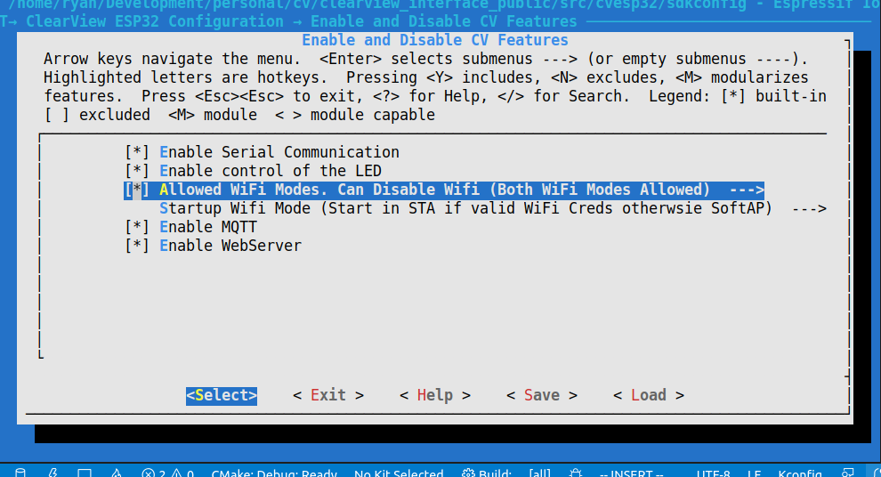
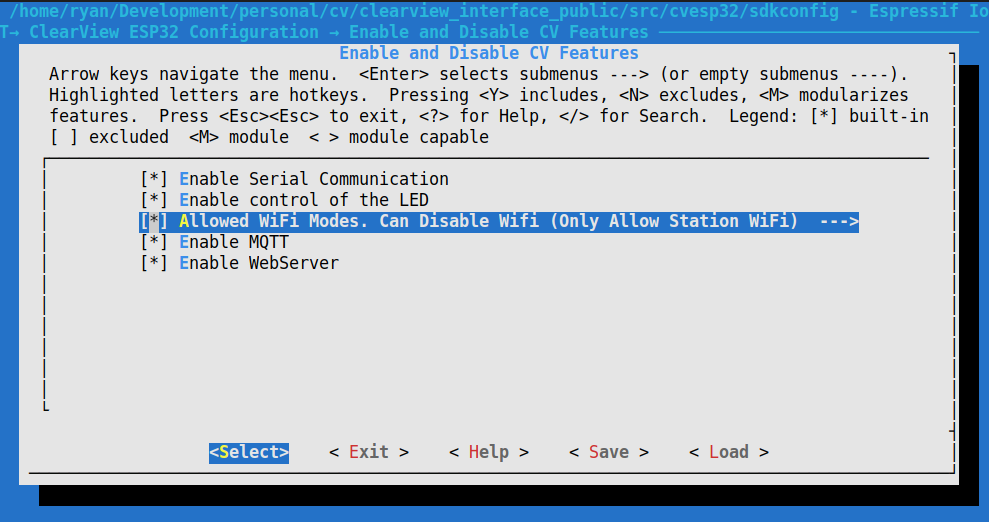
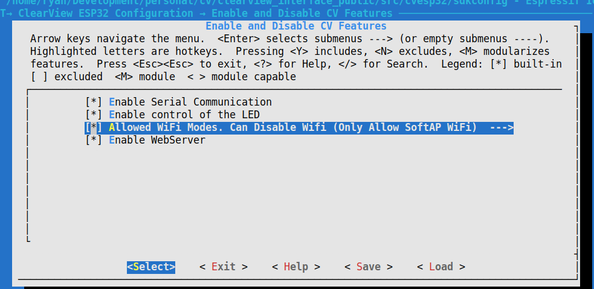

This document serves as a user manual for the ESP32 Wireless Dongle.

# Update Instructions
## Check Firmware Version
## Push Update

# LED Codes
* Slow Blinking = Hotspot Mode, Errors exist and can be viewed
* Fast Blinking = Hotspot Mode, No errors
* Twinkling = Hotspot Mode, Connected Device
* Bright Solid = Attempting Connection to Network
* Slow Breathing = Connected to WiFi Network, Waiting for MQTT
* Twinkling with 3 flashes = Connected to WiFi Network and MQTT is Active

# Usage Guide
After updating firmware of CV2.0 and pushing the latest OTA file to the dongle, follow the processes below

## Viewing Settings in Hotspot Mode

1. Connect the dongle to the ClearView and power on the ClearView
1. If this is the first time, the ESP32 will "Slow Blink"
1. In Hotspot Mode, the ESP32 generates a WiFi Hotspot. 
   * The SSID begins with "CV_". For example "CV_342932C40A32"
   * The network is unsecured (no password) and allows up to four devices to join
1. Using any laptop or phone with WiFi, go to the WiFi settings and join the network
1. Ignore any errors about not being connected to the internet. It's a local network.
1. Open a web browser and go to this web site [http://192.168.4.1](http://192.168.4.1)
1. It will give you the home page
1. **TODO** ---further--usage--here

# Troubleshooting
* Can't connect to WiFi
  * ESP32 only connects to 2.4GHz networks
  * Credentials are incorrect
  * Recommended to log back into Hotspot when it fails back to that and view the error message

# Developer Guide

## Software - Initial Setup

1. Install espidf in the default location it recommends
1. Clone this repo
1. Linux Instructions
   * `$ source ~/esp/esp-idf/export.sh`
   * Or, add this line to ~/.bashrc
     * `$ alias esp='. ~/esp/esp-idf/export.sh'`
     * `$ source ~/.bashrc`
   * `$ cd $clearview_interface_public/src/cvesp32`
   * Connect ESP32 and find port using `$ dmesg | grep tty`
   * `$ idf.py build flash monitor -p /dev/ttyUSB<N>`, where `<N>` is your USB port number
      * example port: `/dev/ttyUSB1`

1. It should build the code, flash it to the ESP32, and then monitor the serial output of the ESP32

## Software - Configuring the ESP32 using Menuconfig

ESPIDF can use idf.py menuconfig to set the options for an ESP32. The default options are setup for what a customer would have set, but for development, there are settings to speed something up. 

Enter the menuconfig with the following. Ensure your terminal is full screen.
* `$ idf.py menuconfig`

Instructions for how to navigate are at the top of the menu.

Using arrow keys to navigate the menu, scroll down to `ClearView ESP32 Configuration` and select it. 

Feel free to adjust any of the top options. Some of these settings can be adjusted from the web server, but for development, it can be helpful to skip any setup phase and specify them here. 

Navigating to the `Enable and Disable CV Features` option, various functionalities can be turned off that the module uses. 

Both serial communication and the LED control can always disabled. 

For `Allowed WiFi Modes` WiFi can be enabled with `y` or disabled with `n`. When WiFi is disabled, there are no options for WiFi related features, as seen in [MenuWifiDisabled]

If enabled, there are three options for WiFi Modes because of the two physical interfaces, SoftAP and Station. SoftAP is also commonly known as Hotspot. 

If enabled, hit enter to view the three choices. Normally, both WiFi modes will be allowed, as seen below.

When both WiFi modes are allowed `Startup WiFi Mode`, `MQTT`, and `WebServer` show up

The WiFi can be limited to `Station Only`. `MQTT`  and `WebServer` are still available but `Startup` disappears.

In `SoftAP` only, the `WebServer` option is available but `MQTT` and `Startup` are gone, as shown below.

The following table sums up the options

| WiFi Modes   | Startup Mode | MQTT     | WebServer                         |
|--------------|--------------|----------|-----------------------------------|
| Disable WiFi | (hidden)     | (hidden) | (hidden)                          |
| Both         | (available)  | (avail)  | [Both, Station Only, SoftAP Only] |
| Station Only | (hidden)     | (avail)  | [Station Only]                    |
| SoftAP Only  | (hidden)     | (hidden) | [SoftAP Only]                     |

Typically the ESP32 starts in SoftAP mode and allows configuration unless it has valid stored credentials to join another AP as a client. This behavior can be overwritten here. 

MQTT allows communication with other devices like lap timers on the wireless network.

The WebServer the CV generates can also be turned off, or customized which WiFi mode it is allowed on. The WebServer is only allowed on WiFi interfaces that are enabled.

